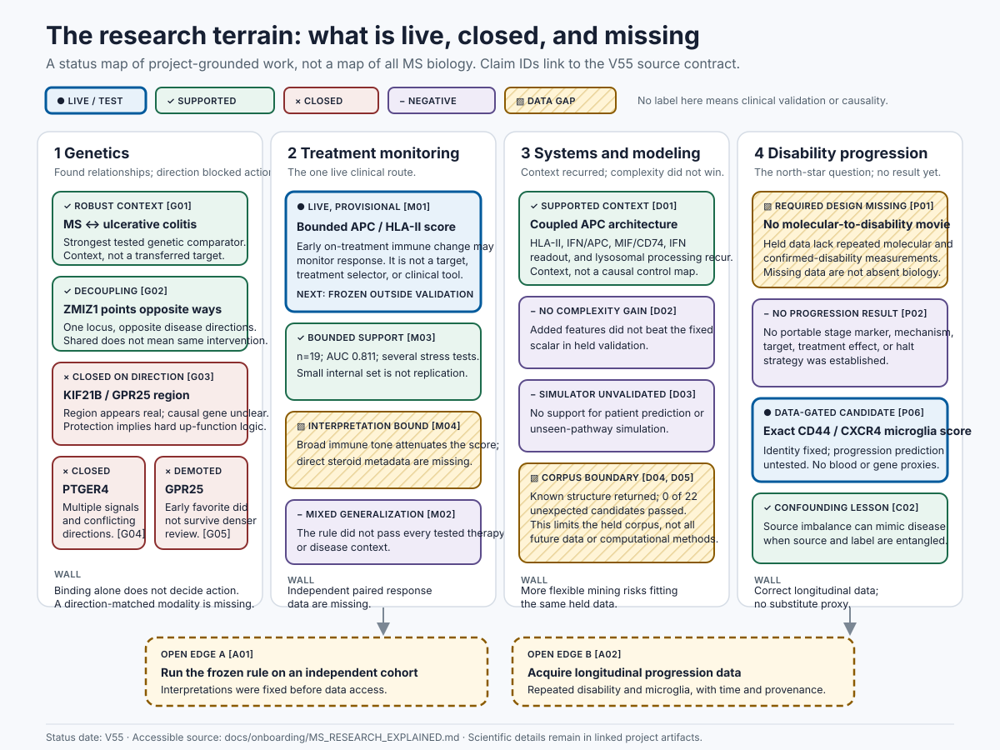

# Start Here: Understand And Contribute To The MS Research

This layer is for smart readers without a medical background. It explains the
project's current evidence state without changing it, makes negative and closed
routes visible, and turns the remaining frontier into testable collaborator
puzzles.

V55 is communication and onboarding only. It introduces no scientific claim.

**Current boundary:** one monitoring lead has internal support but awaits an
independent test. No biological treatment target or progression mechanism has
met the project's evidence standard. This repository is research, not medical
advice or a clinical tool; submit no personal health information or private
data. `[M01, M05, P02]`

## Choose Your Route

Pick one route below. The longer page directory is a reference index, not a
required reading list.

### I Have Two Minutes

1. Read [the two-minute version](MS_RESEARCH_EXPLAINED.md#the-two-minute-version).
2. Scan [the research terrain](visuals/RESEARCH_MAP_V55.svg).
3. Remember the bottom line: one monitoring lead has internal support but
   awaits an independent test; no biological treatment target or progression
   mechanism has met the project's evidence standard. `[M01, M05, P02]`

### I Have Fifteen Minutes

1. Read [the layered explanation](MS_RESEARCH_EXPLAINED.md#the-fifteen-minute-version).
2. Use the [visual guide](VISUAL_INDEX.md) for the monitoring lead, evidence
   lanes, relapse/progression distinction, and collaborator board.
3. Check [the lead status cards](LEAD_STATUS_CARDS.md) before following an
   attractive route.

### I Want To Contribute An Idea

1. Choose one of the eight
   [open problems](OPEN_PROBLEMS_FOR_COLLABORATORS.md#pick-a-puzzle).
2. Read its known non-solutions.
3. Use [the contribution guide and idea template](HOW_TO_CONTRIBUTE_IDEAS.md).
4. [Open the research-direction issue form](https://github.com/sleibach/multiple-sclerosis-auto-research/issues/new?template=research-direction.yml).
   A useful idea states what it predicts and the data it needs. It also names
   a fair comparison or untouched test set, how chance findings will be
   controlled, and a result that would make us drop it. Do not include personal
   health information, credentials, private data, or requests for medical
   advice.

### I Want To Invite Someone Else

Share the concise [collaborator invitation](INVITE_COLLABORATORS.md). It states
the honest frontier, useful skill types, six puzzles, and the safety boundary.

### I Have A Personal Health Question

This repository cannot interpret symptoms, recommend treatment, or accept
personal health records. Read the [patient and public safety boundary](PATIENT_AND_PUBLIC_SAFETY.md)
for safe research-only alternatives.

### I Am Reviewing Scientific Evidence

Start with the source artifacts rather than onboarding prose:

- [Authoritative scored findings](../reports/FINDINGS_REPORT_V37.md)
- [Therapeutic path](../reports/THERAPEUTIC_PATH_V52.md)
- [Joint-inference boundary](../history/JOINT_INFERENCE_V41.md)
- [Progression frontier](../history/PROGRESSION_FRONTIER_V54.md)
- [V55 claim-source contract](CLAIM_SOURCE_MATRIX_V55.md)
- [Machine-readable claim rows](ONBOARDING_CLAIM_SOURCES_V55.tsv)

## Visual Overview



[Open the accessible visual index and text equivalents](VISUAL_INDEX.md).

## Find The Right Page

### Reader And Contributor Pages

| need | page |
|---|---|
| Understand MS, the project, and the honest frontier | [MS Research, Explained](MS_RESEARCH_EXPLAINED.md) |
| Print or share a one-page orientation | [Collaborator Brief](COLLABORATOR_BRIEF_V55.html) ([linear text](COLLABORATOR_BRIEF_V55.md)) |
| Learn where evidence, code, data, validation, and outside context live | [Repository Tour](REPOSITORY_TOUR.md) |
| Turn literature, database, or model context into a fair future test | [Outside Context To Test](CASE_STUDY_CONTEXT_TO_TEST.md) |
| See every major route at a glance | [Visual Guide](VISUAL_INDEX.md) |
| Choose a cross-disciplinary puzzle | [Open Problems](OPEN_PROBLEMS_FOR_COLLABORATORS.md) |
| Share a concise invitation with a smart generalist | [Invite Collaborators](INVITE_COLLABORATORS.md) |
| Pick a bounded first task with an explicit done criterion | [Starter Contributions](STARTER_CONTRIBUTIONS.md) |
| Find where my discipline fits | [Collaborator Routes](COLLABORATOR_ROUTES.md) |
| Start from questions my discipline can sharpen | [Question Starters By Discipline](QUESTION_STARTERS_BY_DISCIPLINE.md) |
| Draft a reviewable test card in ten minutes | [Your First Idea In Ten Minutes](FIRST_IDEA_IN_TEN_MINUTES.md) |
| Compare ready, repairable, closed, and unsafe issue forms | [Public Issue Examples](PUBLIC_ISSUE_EXAMPLES.md) |
| Compare ready and repair-needed data, method, visual, and challenge submissions | [Contribution Examples By Type](CONTRIBUTION_EXAMPLES_BY_TYPE.md) |
| Challenge a claim, closure, boundary, or decision with a countertest | [Challenge The Project](CHALLENGE_THE_PROJECT.md) |
| Get a short answer to a scope or evidence question | [FAQ](FAQ.md) |
| Turn a broad thought into a fair test | [Worked Idea Transformations](IDEA_TRANSFORMATIONS.md) |
| Submit a dataset or cohort lead with verified eligibility | [Contribute A Data Source](CONTRIBUTE_A_DATA_SOURCE.md) |
| Submit an algorithm or analytical method with a fair evaluation | [Contribute A Method](CONTRIBUTE_A_METHOD.md) |
| Improve documentation or a visual without changing scientific status | [Contribute Documentation Or A Visual](CONTRIBUTE_DOCUMENTATION_OR_VISUAL.md) |
| Understand the no-medical-advice and no-personal-data boundary | [Patient And Public Safety](PATIENT_AND_PUBLIC_SAFETY.md) |
| Facilitate a cross-disciplinary idea session | [Collaborator Workshop Guide](COLLABORATOR_WORKSHOP_GUIDE.md) |
| Test whether the onboarding actually works | [Comprehension Test Kit](COMPREHENSION_TEST_KIT.md) |
| Facilitate a human documentation test consistently | [Comprehension Facilitator Handoff](COMPREHENSION_FACILITATOR_HANDOFF.md) |
| Recruit documentation-test volunteers safely | [Human Pilot Recruitment Handoff](HUMAN_PILOT_RECRUITMENT_HANDOFF.md) |
| Review an incoming idea transparently | [Idea Triage Rubric](IDEA_TRIAGE_RUBRIC.md) |
| Triage an incoming idea with the compact maintainer card | [Maintainer Triage Quick Card](MAINTAINER_TRIAGE_QUICK_CARD.md) |
| Submit a falsifiable idea | [How To Contribute Ideas](HOW_TO_CONTRIBUTE_IDEAS.md) |
| Understand every required field in the public submission form | [Issue Form Field Guide](ISSUE_FORM_FIELD_GUIDE_V55.md) |
| Know what happens after submission | [Contributor Response Lifecycle](WHAT_HAPPENS_TO_YOUR_IDEA.md) |
| Follow a fictional submission through repair and five possible verdicts | [Worked Submission Lifecycle](WORKED_SUBMISSION_LIFECYCLE.md) |
| Respond to a contribution with an exact, non-personal status | [Review Response Templates](REVIEW_RESPONSE_TEMPLATES.md) |
| Separate workflow, test validity, and evidence status | [Status Decoder](STATUS_DECODER.md) |
| Decode terms | [Glossary](GLOSSARY.md) |
| Find the exact project status behind a gene, method, or tempting conclusion | [Find By Term](FIND_BY_TERM.md) |
| Prevent common overreads | [Myths vs Actual Findings](MYTHS_AND_ACTUAL_FINDINGS.md) |
| Search tested shortcuts before proposing | [Known Non-Solutions](KNOWN_NON_SOLUTIONS.md) |
| Distinguish null, closed, mixed, inconclusive, invalid, and data-blocked outcomes | [How To Read Nulls And Boundaries](HOW_TO_READ_NULLS_AND_BOUNDARIES.md) |
| Interpret AUC, intervals, p/q values, permutations, multiplicity, and cross-validation | [How To Read Numbers Without Overreading](HOW_TO_READ_NUMBERS_WITHOUT_OVERREADING.md) |
| See how source imbalance changed a biological interpretation | [Brain-Bank Confounding Case Study](CASE_STUDY_BRAIN_BANK_CONFOUND.md) |
| Learn the four recurring inference corrections in sequence | [Four-Case Learning Path](CASE_STUDY_LEARNING_PATH.md) |
| Apply a source, batch, immune-tone, composition, and timing screen | [Confound Check Quick Reference](CONFOUND_CHECK_QUICK_REFERENCE.md) |
| See why real genetic regions failed as intervention routes | [Genetics Reversal Case Study](CASE_STUDY_GENETICS_REVERSALS.md) |
| Understand why a predictive readout is not an intervention | [Monitor vs Target Case Study](CASE_STUDY_MONITOR_VS_TARGET.md) |
| Understand why progression needs a longitudinal molecular-disability movie | [Progression Snapshot vs Movie Case Study](CASE_STUDY_PROGRESSION_SNAPSHOT_VS_MOVIE.md) |
| Understand why attractive routes failed | [Failure-Mode Atlas](FAILURE_MODE_ATLAS.md) |
| See what data could change each answer | [Data That Would Change The Answer](DATA_THAT_WOULD_CHANGE_THE_ANSWER.md) |
| See how candidates were promoted, bounded, demoted, or closed | [Research Evolution Timeline](RESEARCH_EVOLUTION_TIMELINE.md) |
| Check one route's status | [Lead Status Cards](LEAD_STATUS_CARDS.md) |

### Maintenance And Audit Records

These pages document how the public layer was checked. They are not additional
scientific findings and are not required before contributing.

| maintenance need | record |
|---|---|
| Inspect accessibility | [Accessibility Audit](ACCESSIBILITY_AUDIT_V55.md) |
| Check phone/tablet/print delivery | [Narrow-Screen And Print Review](RESPONSIVE_PRINT_REVIEW_V55.md) |
| Maintain or release the onboarding layer | [Maintainer Release Checklist](MAINTAINER_RELEASE_CHECKLIST_V55.md) |
| Check that teaching metaphors retain explicit limits | [Analogy Safety Review](ANALOGY_SAFETY_REVIEW_V55.md) |
| Inspect the final high-risk wording scan | [Newcomer Ambiguity Review](NEWCOMER_AMBIGUITY_REVIEW_V55.md) |
| Inspect the final cross-page status, safety, count, and navigation review | [Final Drift And Safety Review](FINAL_DRIFT_AND_SAFETY_REVIEW_V55.md) |
| See what V55 added and what scientific state did not change | [V55 Public Release Notes](RELEASE_NOTES_V55.md) |
| Inspect core route depth and reciprocity | [Newcomer Route-Depth Review](ROUTE_DEPTH_REVIEW_V55.md) |
| Inspect internal/external links and descriptive labels | [Link And Label Review](LINK_AND_LABEL_REVIEW_V55.md) |
| Inspect heading hierarchy and table semantics | [Semantic Structure Review](SEMANTIC_STRUCTURE_REVIEW_V55.md) |
| Inspect what a newcomer sees before deeper scrolling | [Public First-Screen Review](FIRST_SCREEN_REVIEW_V55.md) |
| Inspect the public package from a clean shallow clone | [Clean-Clone Smoke Test](CLEAN_CLONE_SMOKE_TEST_V55.md) |
| Inspect whether contributor templates remain safe when copied | [Copy/Paste Safety Review](COPY_PASTE_SAFETY_REVIEW_V55.md) |
| Verify every open puzzle reaches a scoped stop list, current status, and contribution action | [Anti-Duplication Route Review](ANTI_DUPLICATION_ROUTE_REVIEW_V55.md) |
| Verify every specialized contribution guide reaches examples, safety, submission, and review outcomes | [Contributor Route Consistency Review](CONTRIBUTOR_ROUTE_CONSISTENCY_REVIEW_V55.md) |
| Inspect the lightweight, self-contained public package budget | [Public Package Footprint Review](PUBLIC_PACKAGE_FOOTPRINT_V55.md) |
| Check that public page titles and roles do not collide | [Title And Role Review](TITLE_AND_ROLE_REVIEW_V55.md) |
| Inspect whether the entrance keeps primary choices bounded before maintenance detail | [Landing-Page Choice Review](LANDING_PAGE_CHOICE_REVIEW_V55.md) |
| Inspect the pre-glossary jargon review | [Zero-Jargon Entry Review](ZERO_JARGON_ENTRY_REVIEW_V55.md) |
| Inspect plain-language load | [Plain-Language Review](PLAIN_LANGUAGE_REVIEW_V55.md) |
| See which sources control which pages | [Source Coverage](SOURCE_COVERAGE_V55.md) |
| Inspect machine traceability | [Onboarding Audit Summary](../../analysis/v55_onboarding_audit/onboarding_audit_summary.json) |

## Evidence Promise

- Every scientific statement in this layer maps to a bounded claim row and
  committed source artifact.
- Status is always part of the statement: project-grounded, provisional,
  supported context, negative/closed, or data blocked.
- Outside-source context and model suggestions remain separate from project
  evidence.
- Missing data are not described as absent biology.
- Monitoring, mechanism, target, clinical benefit, and progression are not
  collapsed into one claim.

The automated V55 onboarding audit checks this boundary. Its current committed
result is `PASS` across all expected pages, visuals, claim references, local
links, semantic SVG metadata, size limits, and palette contrast.

## Automated Integrity Checks

The public onboarding layer has a secret-free continuous check at
`.github/workflows/onboarding-integrity.yml`. It runs on relevant pushes and
pull requests and can also be launched manually. The same checks can be run
locally:

```bash
python3 scripts/v55_onboarding_audit.py --fail-on-error
python3 scripts/v55_onboarding_audit.py --synthetic-check --fail-on-error
python3 scripts/v55_plain_language_audit.py --fail-on-error
python3 scripts/v55_source_coverage.py --fail-on-error
python3 scripts/v55_route_depth_audit.py --fail-on-error
python3 scripts/v55_semantic_structure_audit.py --fail-on-error
python3 scripts/v55_public_package_footprint.py --fail-on-error
python3 scripts/v47_provenance_gate.py audit --fail-on-error
python3 scripts/v51_structural_prediction_gate.py audit --fail-on-error
python3 scripts/v55_visual_render_regression.py --fail-on-error
python3 scripts/v55_responsive_visual_audit.py --fail-on-error
python3 scripts/v55_print_brief_audit.py --fail-on-error
python3 scripts/v55_onboarding_manifest.py --check --fail-on-error
```

These commands test communication traceability, evidence-class separation,
static visual accessibility, and rendering. They do not validate a scientific
claim.
